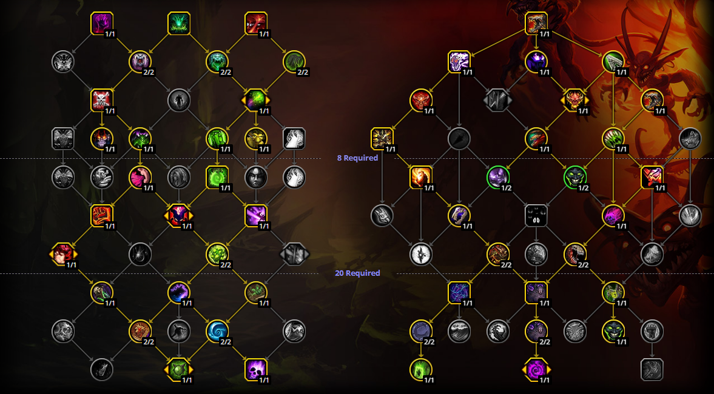

# Vault of the Incarnates

## Warlock Notes

### Eranog

\
Talent String:
\
\
BoQAAAAAAAAAAAAAAAAAAAAAAggkEJSg0SLCSLJJkSAAAAAQLSSSIBSIRyBi0SicACAAAAAAA

\
\
Playstyle notes:
test

### Terros

\
Talent String:
\
\
BoQAAAAAAAAAAAAAAAAAAAAAAgESSkIBSTLg0SSCpFAAAAA0SkEJEQIRyBSRLJJHgAAAAAAA

Playstyle notes:

### The Primal Council

\
Talent String:
\
\
BoQAAAAAAAAAAAAAAAAAAAAAAAIJRiEi00SJItkkQaBAAAAAtIIhQikIRi0SLJJHgAAAAAAA

Playstyle notes:

### Sennarth

\
Talent String:
\
\
BoQAAAAAAAAAAAAAAAAAAAAAAggkEJSg0SLCSLJJkSAAAAAQLSSSIBSIRyBi0SicACAAAAAAA

Playstyle notes:

### Dathea

\
Talent String:
\
\
BoQAAAAAAAAAAAAAAAAAAAAAAcACSSkIBSTLCSLJJkSAAAAAQLSSSIBSIRiUSLJyBIAAAAAAA

Playstyle notes:

### Kurog Grimtotem

\
Talent String:
\
\
BoQAAAAAAAAAAAAAAAAAAAAAAgESSkIBSTLg0SSCpFAAAAA0ikkESgESkIl0SicACAAAAAAA

Playstyle notes:

### Broodkeeper Diurna

\
Talent String:
\
\
BoQAAAAAAAAAAAAAAAAAAAAAAggkEJSISTjg0SSSkWAAAAAQLSSSIBSIRiUSLJyBIAAAAAAA

Playstyle notes:

### Raszageth

\
Talent String:
\
\
BoQAAAAAAAAAAAAAAAAAAAAAAcACSSkIBSTLCSLJJkWAAAAAQLSSSIBSIRiUSLJyBIAAAAAAA

Playstyle notes:
